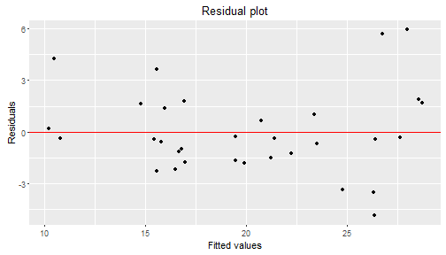

## Summary

I used the "mtcars" dataset in R to predict the MPG of a given car based on the number of cylinders, weight and number of gears.

--- .class #id 

## Loading the data and model fitting

- First the data are added to R

```r
data("mtcars")
```

- Now we take a look at its first rows

```
##                    mpg cyl disp  hp drat    wt  qsec vs am gear carb
## Mazda RX4         21.0   6  160 110 3.90 2.620 16.46  0  1    4    4
## Mazda RX4 Wag     21.0   6  160 110 3.90 2.875 17.02  0  1    4    4
## Datsun 710        22.8   4  108  93 3.85 2.320 18.61  1  1    4    1
## Hornet 4 Drive    21.4   6  258 110 3.08 3.215 19.44  1  0    3    1
## Hornet Sportabout 18.7   8  360 175 3.15 3.440 17.02  0  0    3    2
## Valiant           18.1   6  225 105 2.76 3.460 20.22  1  0    3    1
```

- From these I use 'cyl': Number of cylinders, 'wt': wight in 1000 lbs and 'gear': Number of gears for prediction.

---
## Fitting the model
- Now I fit a linear regression model with 'mpg' as regressor and 'cyl', 'wt' and 'gear' as predictors.

```r
fit <- lm(mpg ~ cyl + wt + gear, data = mtcars)
```

---
## Checking for the validity
- As the final step, to check the validity of the model, I draw a residual plot to see there is no special trend in residuals.



- To use this prediction go to 

https://srhumir.shinyapps.io/Shinysimplefunction/
